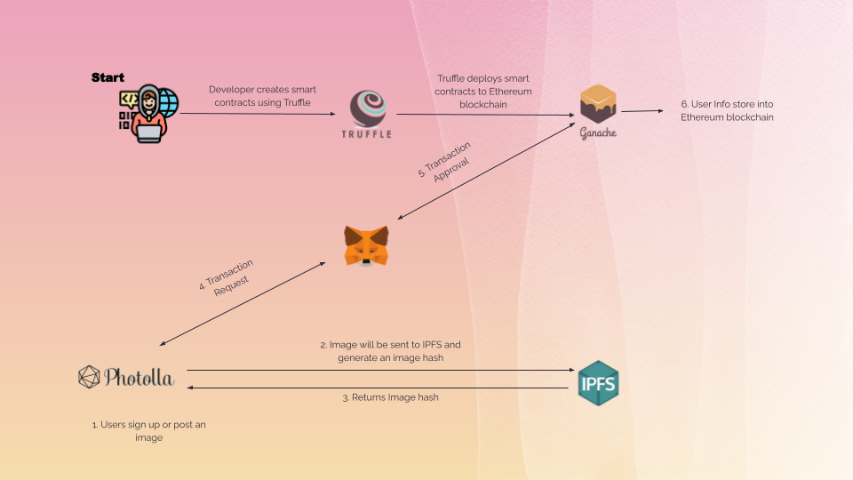

# Photolla
Our project is an art site that is inspired by [Fanbox](https://www.fanbox.cc). <br>
This would mean that creators of their original art are able to post art that will be included into a blockchain. <br>
We provide creators a decentralized platform to earn money from their art. <br>
Our target audience includes:
* Artist🖌️
* Photographers📸
* Designer💻
* Fans/Supporters🎉

# How it's built
* React <br>
* Node.js <br>
* Blockchain  for database
* Truffle  for smart contract deployment.<br>
* IPFS  to store our images.

# How it works


# Demo video
[](https://www.youtube.com/watch?v=)

# Installation and startup
Dependencies:
* [Node.js](https://nodejs.org/en/download/)
* [Git](https://git-scm.com/downloads)

> Clone this repo
```
git clone https://github.com/HackathonScrubs/Photolla.git
```

> Install dependencies via npm
```
npm install
```

> Deploy smart contract via Truffle
```
truffle migration
```

> Start the server
```
npm run start
```

# Contributors
* [Ding Hang](https://github.com/Hanswong42)<br>
* [Eu Lee](https://github.com/42EuLee)<br>
* [Yee Jin](https://github.com/yeejinang)<br>
* [Jian Kai]()<br>
* [Yun Zhe](https://github.com/hooyunzhe)

# References
* [Dappuniversity - Decentragram](https://www.youtube.com/watch?v=8rhueOcTu8k)
* [React](https://reactjs.org/docs)
* [Node.js](https://nodejs.org/en/docs/)
* [Web3.js](https://web3js.readthedocs.io/en/v1.4.0/)
* [Solidity](https://docs.soliditylang.org/en/v0.8.7/)
* [IPFS](https://docs.ipfs.io/)
* [Truffle](https://www.trufflesuite.com/docs)
